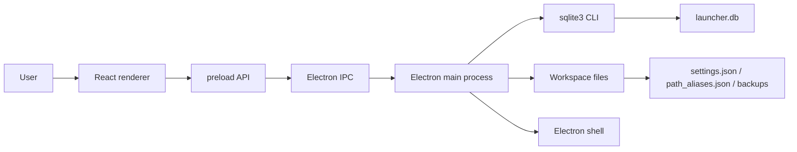
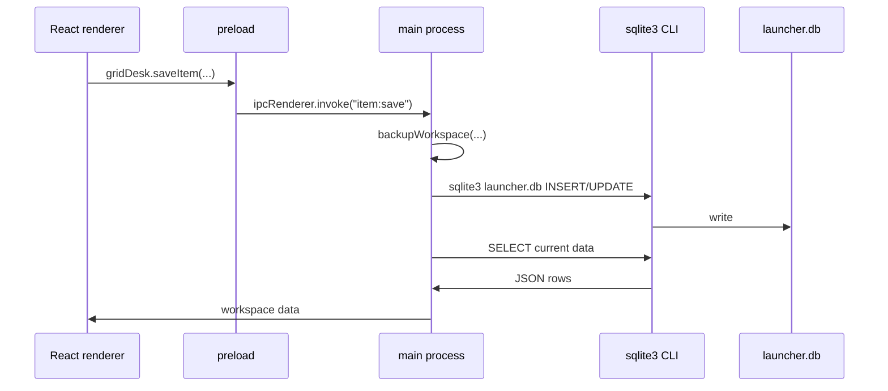
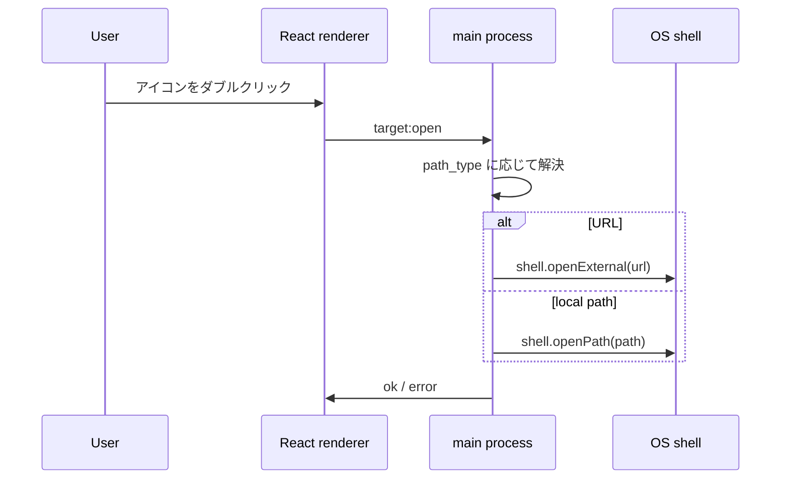
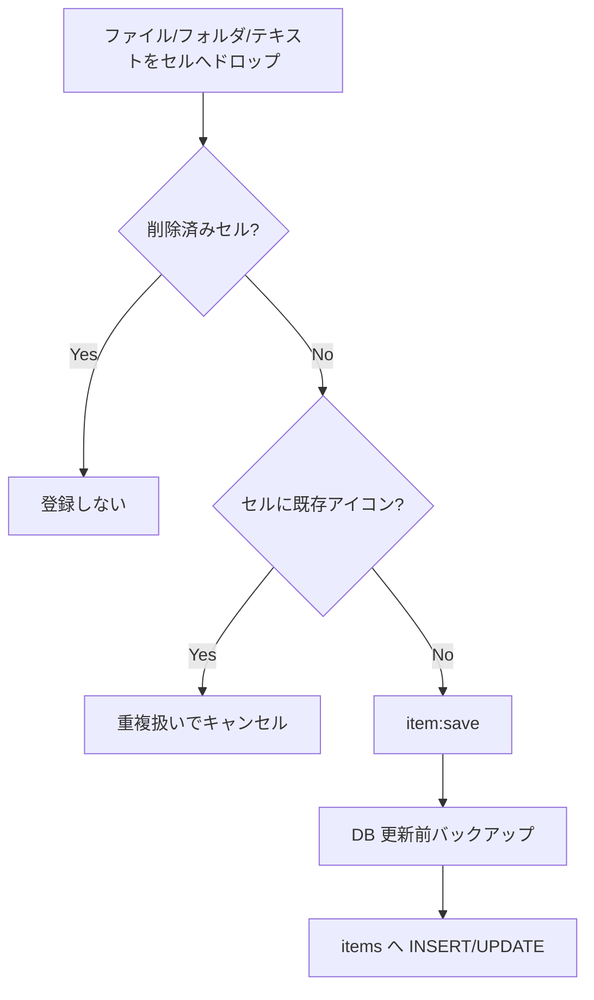

# アーキテクチャ

GridDesk は Electron main process、preload、React renderer、SQLite CLI アクセス層で構成されています。

## Electron main process

`electron/main.cjs` が main process です。主な責務は次のとおりです。

- `BrowserWindow` の作成
- ワークスペースフォルダの選択
- ワークスペース初期化
- SQLite DB の作成/更新
- バックアップ作成
- ファイル/フォルダ/URL の起動
- renderer からの IPC 処理

## preload

`electron/preload.cjs` は `contextBridge` で renderer に限定的な API を公開します。

公開されている主な API:

- `createWorkspace`
- `openWorkspace`
- `openWorkspacePath`
- `createGenre`
- `updateGenre`
- `deleteGenre`
- `saveItem`
- `moveItem`
- `deleteItem`
- `disableCell`
- `restoreCell`
- `openTarget`
- `revealTarget`

## React renderer

`src/App.jsx` が現在の主要 UI です。

主な責務:

- Welcome 画面
- 最近開いたワークスペース表示
- ジャンル管理パネル
- セル登録パネル
- セルグリッド表示
- アイコン選択、登録、移動、起動
- 右クリックメニュー
- トースト表示

## SQLite アクセス層

現在は Node 用 SQLite ライブラリではなく、main process から `sqlite3` CLI を `execFile` で呼び出しています。

## IPC 設計

renderer は Node API を直接触りません。すべて preload API 経由で main process に依頼します。

| IPC | 内容 |
| --- | --- |
| `workspace:create` | ワークスペース作成/初期化 |
| `workspace:open` | 既存ワークスペース読込 |
| `genre:create` | ジャンル追加 |
| `genre:update` | ジャンル更新 |
| `genre:delete` | ジャンル削除 |
| `item:save` | アイコン登録または同一 path の更新 |
| `item:move` | アイコン座標更新 |
| `item:delete` | アイコン論理削除 |
| `cell:disable` | セル削除 |
| `cell:restore` | セル復活 |
| `target:open` | 対象起動 |
| `target:reveal` | Finder/Explorer で場所を開く |

## ファイル/フォルダ起動の流れ

## ドラッグ＆ドロップ登録の流れ

## DB 更新とバックアップの流れ

DB を変更する前に `backupWorkspace` を呼び出します。対象は `launcher.db`, `settings.json`, `path_aliases.json` です。

## セキュリティ上の注意

- `contextIsolation: true`
- `nodeIntegration: false`
- renderer に `fs` や `child_process` を直接公開しない
- preload では必要な API のみ公開する
- SQL は現在独自の `sqlValue` でエスケープしているが、将来的には prepared statement 対応の SQLite ライブラリやアクセス層の改善を検討する

## 未実装または今後整理する点

- packaged app の作成
- migration 管理
- path_aliases の編集 UI
- リンク切れチェックの定期実行
- エクスポート/インポート
- テスト自動化
